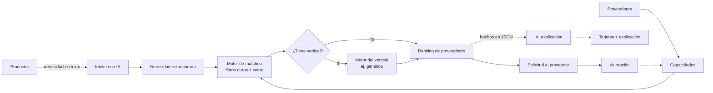
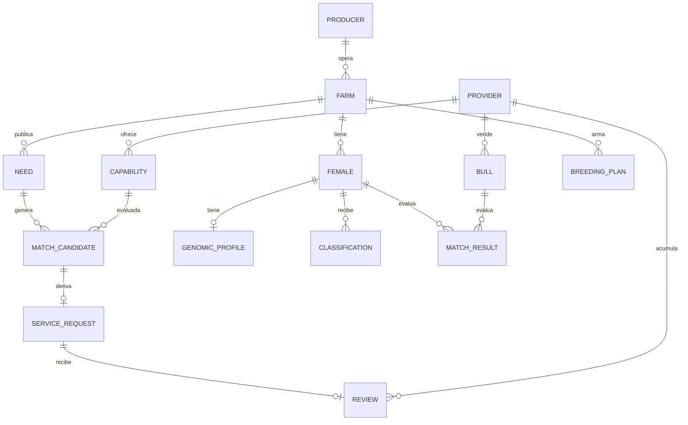
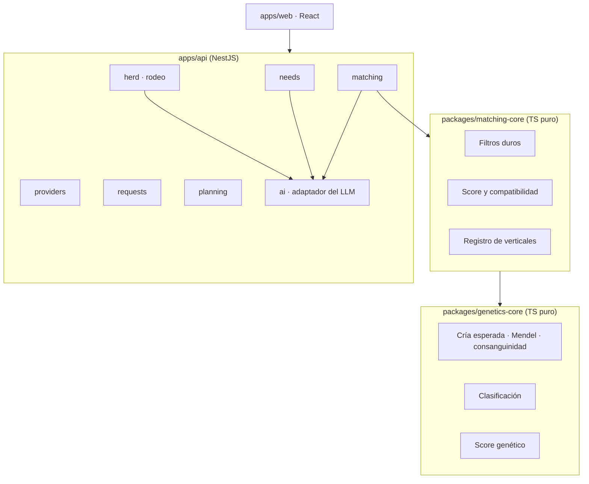

# Modelo de dominio

**El producto conecta y resuelve necesidades del agro.** Cualquier necesidad entra en lenguaje natural; un motor determinístico calcula quién la resuelve mejor y la IA explica por qué. Donde la necesidad tiene un cálculo real detrás, entra un **motor especializado** (vertical). El primero es **genética para tambos (Torinder)**.

Este documento conecta todos los conceptos del negocio: qué entidades existen, cómo se relacionan, qué reglas las gobiernan y en qué módulo vive cada cosa. **Si un concepto no está acá, todavía no existe en el producto.**

> Leé primero [conceptos-dominio-y-negocio.md](conceptos-dominio-y-negocio.md) si no conocés el mundo del tambo, y [validacion-mercado.md](validacion-mercado.md) para saber contra quién competimos.

---

## 0. Las dos capas

| Capa | Qué resuelve | Cómo puntúa | Ejemplo |
|---|---|---|---|
| **Núcleo: necesidad × capacidad** | Cualquier necesidad del agro | Cobertura, disponibilidad, capacidad, precio, reputación | "Necesito quien me are 40 ha en Río Cuarto la semana que viene" |
| **Verticales** | Necesidades con cálculo propio | El motor del vertical | "Quiero mejorar los sólidos de mi rodeo" → matching genético |

**Por qué las dos:** el núcleo da alcance y el vertical da profundidad. Y hay una razón de negocio: en los marketplaces de servicios la **desintermediación** se lleva hasta el 80% de los ingresos, porque las partes se conocen y arreglan por afuera. **Nadie vuelve a una lista de contratistas; sí volvés todos los meses a algo que te dice qué hacer con cada vaca.** El vertical es lo que retiene.

---

## 1. Mapa en 30 segundos



---

## 2. Lenguaje ubicuo: núcleo

Una palabra = un concepto. En la documentación usamos el término en español; en el código, el nombre en inglés.

| Término | Código | Definición |
|---|---|---|
| Productor | `Producer` | Quien tiene la necesidad. Un tambo, un agricultor, un criador. |
| Establecimiento | `Farm` | Campo o tambo. Unidad de aislamiento de datos (tenant). |
| Necesidad | `Need` | Lo que el productor necesita, ya estructurado. |
| Texto original | `rawText` | Lo que el productor escribió o dictó. Siempre se guarda. |
| Categoría | `NeedCategory` | `MACHINERY`, `VET`, `INPUTS`, `ADVISORY`, `SOFTWARE`, `FINANCE`, `GENETICS`, `OTHER` |
| Ventana | `TimeWindow` | Desde cuándo y hasta cuándo se necesita. |
| Magnitud | `Magnitude` | Cuánto: hectáreas, cabezas, toneladas, unidades. |
| Proveedor | `Provider` | Quien resuelve: contratista, veterinario, distribuidor, software, asesor. |
| Capacidad | `Capability` | Qué resuelve un proveedor y con qué límites: categoría, radio, capacidad diaria, precio, certificaciones. |
| Cobertura | `coverageRadiusKm` | Hasta dónde llega el proveedor desde su base. |
| Candidato | `MatchCandidate` | Par necesidad × capacidad, ya evaluado. |
| Ajuste | `fit` | Desglose del score: cercanía, disponibilidad, capacidad, precio, reputación, vertical. |
| Vertical | `VerticalEngine` | Motor especializado de una categoría. El primero: `GENETICS`. |
| Solicitud | `ServiceRequest` | El productor le pide presupuesto o contacto a un proveedor. |
| Valoración | `Review` | Puntaje y comentario después del trabajo. |
| Reputación | `reputation` | Promedio de valoraciones + trabajos completados. |

---

## 3. Lenguaje ubicuo: vertical genética (Torinder)

| Término | Código | Definición |
|---|---|---|
| Hembra | `Female` | Ternera, vaquillona o vaca del rodeo. |
| Categoría | `FemaleCategory` | `CALF`, `HEIFER`, `COW` |
| Perfil genómico | `GenomicProfile` | Valores genéticos + caseínas + escala + fuente. |
| Vector de rasgos | `TraitVector` | `{ ci, milk, fat, pro, pl, scs, fs, rfi }` |
| Escala | `Scale` | Base de evaluación. MVP: solo `CDCB`. |
| Caseínas | `BetaCasein` / `KappaCasein` | `A1/A1`, `A1/A2`, `A2/A2` / `AA`, `AB`, `BB`, `AE`, `BE`, `EE` |
| Toro | `Bull` | Reproductor identificado por su código NAAB. |
| Central | `SemenCompany` | Empresa que vende semen. Es un `Provider` de categoría `GENETICS`. |
| Tipo de semen | `SemenType` | `SEXED`, `CONVENTIONAL`, `BEEF` |
| Objetivo | `BreedingGoal` | Qué quiere mejorar el tambo, como pesos sobre los rasgos. |
| Clasificación | `Classification` | Tier + motivos + etiquetas + rasgos a corregir. |
| Tier | `Tier` | `ELITE`, `COMMERCIAL`, `BEEF`, `CULL_ALERT` |
| Cría esperada | `ExpectedProgeny` | `(madre + toro) / 2` por rasgo. |
| Plan de servicios | `BreedingPlan` | Toro y tipo de semen asignados a cada hembra. |

---

## 4. Actores

| Actor | Qué hace en el MVP | Qué ve |
|---|---|---|
| **Productor** | Publica necesidades, elige proveedor, usa el vertical genético de su rodeo | Su establecimiento |
| **Proveedor** | Publica sus capacidades y responde solicitudes | Sus capacidades y solicitudes |
| **Asesor** | Opera para varios establecimientos | Panel multi-establecimiento |
| **Admin** | Carga catálogos y valida proveedores | Todo |

---

## 5. Entidades y relaciones



### Atributos clave del núcleo

| Entidad | Atributos |
|---|---|
| `Need` | `id, farmId, rawText, category, what, where: GeoPoint, radiusKm?, window: TimeWindow, magnitude?, constraints[], budget?, status, createdAt` |
| `Provider` | `id, name, type, base: GeoPoint, verified, reputation, contact` |
| `Capability` | `id, providerId, category, serviceType, coverageRadiusKm, capacityPerDay?, availability: TimeWindow[], priceModel, priceFrom?, certifications[], attributes` |
| `MatchCandidate` | `needId, capabilityId, score, compatibility, rank, fit: FitBreakdown, filters: FilterResult[], verticalFacts?, explanation?, reasons[]` |
| `ServiceRequest` | `id, needId, providerId, message, status, createdAt` |
| `Review` | `id, serviceRequestId, providerId, rating, comment, createdAt` |

---

## 6. Reglas del núcleo

| ID | Regla |
|---|---|
| **RN-30** | **Intake con IA.** El texto libre se convierte en `Need` estructurada. **El usuario confirma antes de buscar.** La IA nunca publica una necesidad por su cuenta. |
| **RN-31** | **Filtros duros primero.** Se descarta un candidato si: la categoría no coincide; la distancia supera `coverageRadiusKm`; la ventana no se superpone con la disponibilidad; la capacidad no alcanza para la magnitud; falta una certificación exigida. Cada descarte guarda su motivo. |
| **RN-32** | **Score determinístico** = suma ponderada de cercanía, ajuste de disponibilidad, ajuste de capacidad, precio y reputación. **Sin LLM en el cálculo.** |
| **RN-33** | **Compatibilidad %** = score reescalado de 0 a 100 entre los candidatos de esa necesidad, mostrado como ranking ("#1 de N"), nunca como probabilidad. |
| **RN-34** | **Neutralidad.** El ranking no se compra. Si alguna vez hay posiciones patrocinadas, van **fuera del ranking y etiquetadas**. |
| **RN-35** | **Verticales enchufables.** Si la categoría tiene un `VerticalEngine`, su score reemplaza al componente genérico y sus hechos entran en la explicación. El núcleo no conoce la genética: conoce la interfaz. |
| **RN-36** | **Retención antes que comisión.** El valor que retiene vive en la plataforma: historial, planes, recordatorios y verticales. El dato de contacto se muestra al crear la `ServiceRequest`; la valoración se pide después del trabajo. |
| **RN-37** | **Arranque en frío honesto.** Un proveedor cargado desde una fuente pública y sin confirmar se marca `verified: false` y **se muestra como tal**. Nunca se presenta un proveedor no verificado como cliente de la plataforma. |
| **RN-38** | **Aislamiento.** Los datos de un establecimiento no se ven desde otro. El asesor ve solo los suyos. |
| **RN-39** | **Trazabilidad.** Toda necesidad guarda su `rawText`, su estructura confirmada y los `reasons` de cada candidato. |

## 7. Reglas de IA (valen para las dos capas)

| ID | Regla |
|---|---|
| **RN-17** | **La IA nunca produce números del motor.** Recibe un JSON de hechos y solo redacta. |
| **RN-18** | **Control de alucinación.** Cada número de la explicación tiene que existir en los hechos. Si no, se muestra el texto determinístico de `reasons`. |
| **RN-19** | **Carga asistida.** La IA propone el mapeo de un Excel o la extracción de un PDF, y un humano confirma antes de importar. |
| **RN-20** | **Lenguaje natural → estructura.** Vale para el objetivo del tambo y para la necesidad (RN-30). El usuario ve y ajusta lo interpretado. |

## 8. Reglas del vertical genética

| ID | Regla |
|---|---|
| **RN-01** | **Escala única `CDCB`.** Lo que no la declara, no entra al motor. |
| **RN-02** | **Cría esperada** = `(madre[rasgo] + toro[rasgo]) / 2`. |
| **RN-03** | **Dirección de los rasgos.** SCS y RFI: menos es mejor. El resto: más es mejor. |
| **RN-04** | **Caseínas por Mendel.** Cada padre aporta un alelo con probabilidad 50%. |
| **RN-05** | **Consanguinidad (MVP, por pedigrí).** Se excluye el toro si es el padre (25%) o si comparte padre con la hembra (12,5%). Umbral: 6,25%. ⚠️ No hay abuelo materno en los datos. |
| **RN-06** | **Facilidad de parto.** En `HEIFER` y `CALF`, solo toros dentro del umbral del establecimiento. Sin dato, queda excluido con aviso. |
| **RN-07** | **Percentil dentro del rodeo**, nunca umbrales absolutos fijos. |
| **RN-08** | **Cupos por reposición.** Top `sexedPct`% → `ELITE`; bottom `beefPct`% → `BEEF`; el resto → `COMMERCIAL`. Por defecto 25% / 30%. |
| **RN-09** | **Las alertas de salud NUNCA mandan a carne.** SCS > 3,18 o PL < 0: una `ELITE` baja a `COMMERCIAL`; una `COMMERCIAL` se queda con **apareamiento correctivo** (el rasgo entra en `corrective` y pesa el doble). |
| **RN-10** | **Protección por objetivo.** Con objetivo A2 o quesería, una A2/A2 o BB no cae en `BEEF` solo por percentil. |
| **RN-11** | **Alerta de descarte** (`CULL_ALERT`): condición simultánea extrema. Es una alerta, nunca una acción automática. |
| **RN-12** | **Precedencia explícita:** cupo → salud → protección por objetivo → alerta de descarte. Todo queda en `reasons`. |
| **RN-13** | **El tier define el catálogo.** `ELITE` → sexado; `COMMERCIAL` → convencional; `BEEF` → toros de carne. |
| **RN-14** | **Score** = Σ peso × rasgo normalizado de la cría, más bonus por caseína deseada. Los filtros van antes. |
| **RN-15** | **Compatibilidad %** relativa entre candidatos, mostrada como ranking. |
| **RN-16** | **Toros de carne:** se ordenan por facilidad de parto, raza y precio. |
| **RN-21** | *(Reemplazada por RN-38: aislamiento multi-establecimiento.)* |
| **RN-22** | **Catálogo global de toros:** un toro existe una sola vez, por código NAAB. |
| **RN-23** | *(Reemplazada por RN-34: neutralidad.)* |
| **RN-24** | **Datos incompletos.** Hembra sin genotipado, fuera del motor con aviso. Sin padre, etiqueta `NO_SIRE`. |

---

## 9. Flujos principales

### Núcleo

| # | Flujo | Pasos | Reglas |
|---|---|---|---|
| **N1** | Publicar una necesidad | Texto o audio → la IA la estructura → el productor confirma o ajusta → se guarda `Need` | RN-30, RN-20, RN-39 |
| **N2** | Matchear proveedores | Filtros duros → score → compatibilidad → la IA explica cada candidato | RN-31 a RN-35, RN-17, RN-18 |
| **N3** | Solicitar el servicio | El productor elige → `ServiceRequest` con el contacto → el proveedor responde | RN-36 |
| **N4** | Valorar | Terminado el trabajo, se pide la valoración y alimenta la reputación | RN-36 |
| **N5** | Alta de proveedor | Alta manual o carga asistida desde catálogo o directorio → `verified` según corresponda | RN-19, RN-37 |

### Vertical genética

| # | Flujo | Pasos | Reglas |
|---|---|---|---|
| **F1** | Carga del rodeo | Excel → la IA propone el mapeo → confirmación → `Female` + `GenomicProfile` | RN-01, RN-19, RN-24 |
| **F2** | Clasificación | Percentiles → cupos → alertas de salud → protección por objetivo | RN-07 a RN-12 |
| **F3** | Swipe de toros | Objetivo → filtros → score → explicación → like | RN-02 a RN-06, RN-13 a RN-18 |
| **F4** | Plan de servicios | Likes o plan automático → totales → exportar | RN-14 |
| **F5** | Carga de catálogo | PDF de una central → la IA extrae → confirmación → upsert por NAAB | RN-01, RN-19, RN-22 |
| **F6** | Chat sobre el rodeo | Pregunta → consulta al motor → respuesta con datos | RN-17, RN-20 |
| **F7** | Panel del asesor | Tambos, estado y comparativa | RN-38 |

---

## 10. Del dominio a la arquitectura



| Módulo | Responsabilidad |
|---|---|
| `matching-core` | Filtros, score, compatibilidad y **registro de verticales**. No conoce genética ni NestJS. |
| `genetics-core` | El vertical: RN-01 a RN-16. Se registra en `matching-core` con la interfaz `VerticalEngine`. |
| `needs` | Alta y ciclo de vida de las necesidades |
| `providers` | Proveedores, capacidades y reputación |
| `matching` | Orquesta el matcheo y pide la explicación |
| `requests` | Solicitudes y valoraciones |
| `herd`, `planning` | Rodeo y plan de servicios del vertical |
| `ai` | Puerto y adaptador del LLM: intake, mapeo, explicación, chat |
| `web` | Necesidad, resultados, vertical, panel |

**Principio:** las dependencias apuntan al núcleo. El núcleo no conoce NestJS, ni la base de datos, ni el LLM. **Un vertical nuevo no toca el núcleo: se registra.**

```ts
export interface VerticalEngine<TFacts> {
  category: NeedCategory;
  canHandle(need: Need): boolean;
  score(need: Need, candidate: MatchCandidate): { score: number; facts: TFacts; reasons: string[] };
}
```

---

## 11. Alcance del MVP frente a la hoja de ruta

| Entra en el MVP | Hoja de ruta |
|---|---|
| Intake de necesidad en lenguaje natural (N1) | Audio y WhatsApp |
| Matcheo genérico con filtros y score (N2) | Optimización multi-necesidad y logística |
| Solicitud de servicio y estado (N3) | Pagos, contratos y escrow |
| Vertical genética completo (F1 a F4, F7) | Verticales de maquinaria y nutrición |
| Proveedores semilla de 3 categorías | Alta abierta y verificación real |
| Explicación de la IA en todo | Valoraciones y reputación con historial |

---

## 12. Decisiones abiertas

| # | Decisión | Impacta en |
|---|---|---|
| D1 | Qué es el **CI** | RN-07, RN-08 |
| D2 | Validar el algoritmo de clasificación | RN-08, RN-09 |
| D3 | Umbral de facilidad de parto | RN-06 |
| D4 | Login real o usuarios simulados | RN-38 |
| ~~D5~~ ✅ | **Resuelta:** Anthropic Claude, modelo **Haiku 4.5** (`claude-haiku-4-5`), vía `@anthropic-ai/sdk`, detrás del puerto `LlmClient` | Módulo `ai` |
| D6 | Plan automático simple o con restricciones | F4 |
| ~~D7~~ 🟡 | **Propuesto: AgroMatch** (producto) + **Torinder** (vertical genético). Falta que el equipo lo confirme; no bloquea nada. Ver [definiciones-de-negocio.md](definiciones-de-negocio.md) N1 | Pitch, dominio, marca |
| ~~D8~~ ✅ | **Resuelta: maquinaria, veterinaria y genética.** Insumos queda afuera del MVP: ahí Agrofy, Agroads y Mercado Libre ya dominan | N2, M7, demo |
