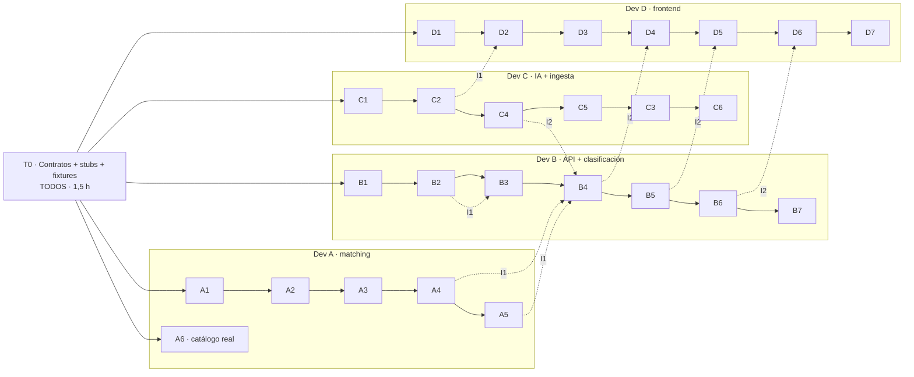

# Plan de trabajo del MVP de Torinder (4 devs, ~20 h)

> **Para agentes:** cada tarea se implementa con TDD. Los **criterios de aceptación** de cada tarea son los primeros tests que escribe el agente. Marcar los checkboxes al cerrar.

**Objetivo:** construir el MVP con 4 devs trabajando en paralelo **sin bloquearse entre sí**. El MVP tiene dos capas:
1. **Núcleo (M1–M7):** necesidad en lenguaje natural → filtros duros → score → proveedores rankeados → explicación → solicitud.
2. **Vertical genético, Torinder (T0, A, B, C, D):** carga del rodeo → clasificación → swipe de toros → plan de servicios. Es el primer vertical y el que retiene.

**Arquitectura:** monorepo con un paquete de **contratos** compartido, un **núcleo de matcheo** (`matching-core`) y un **motor genético** (`genetics-core`), los dos en TypeScript puro; una API en NestJS que orquesta, una capa de **IA detrás de puertos** y un frontend React. El paralelismo sale de un principio: **después de la hora 0, nadie depende del código de otro, solo de los contratos.**

**Stack (el que ya está en `develop`):** **Nx 23 + npm workspaces** · TypeScript · NestJS (`apps/backend`, puerto 3333, prefijo `/api`) · React + Vite + Tailwind (`apps/frontend`, puerto 4200) · `packages/shared-types` · MSW (mocks en el front) · SheetJS (Excel) · **`@anthropic-ai/sdk` con Claude Haiku 4.5** (`claude-haiku-4-5`).

**Spec:** [modelo-de-dominio.md](modelo-de-dominio.md) (reglas RN-xx y flujos Fx). Este plan implementa ese documento.

## Restricciones globales
- Un solo idioma de punta a punta: **TypeScript**.
- **Escala única CDCB** (RN-01). Todo valor genético que entra al motor declara `scale: 'CDCB'`.
- **La IA nunca produce números del motor** (RN-17). Toda salida de un LLM pasa por validación.
- Persistencia: **PostgreSQL + Prisma** (Docker Compose). Todo detrás de interfaces de repositorio; los datos semilla entran por un seed que se puede volver a correr.
- Usuarios MVP: **simulados** con el header `x-user-id`. No hay login.
- La demo corre **100% real**: Claude en vivo, nada pregrabado. Se prueba la conexión en el lugar antes de presentar.
- Commits convencionales. Una tarea = una rama = un PR chico. `main` siempre en verde.

---

## Cómo leer este plan

1. **Sección 1:** por qué 4 personas pueden trabajar sin pisarse.
2. **Sección 2:** quién hace qué.
3. **Sección 3 (T0):** lo que se construye **entre todos en la primera hora y media**. Es la parte más importante.
4. **Sección 4:** las tareas de cada dev.
5. **Secciones 5 y 6:** dependencias, camino crítico y cronograma.

---

## 1. Cómo se logra el paralelismo

Toda dependencia entre devs se reemplaza por un **sustituto** hasta que llega la pieza real. Así cada uno trabaja contra los contratos desde el minuto 0.

| Si necesitás… | …y todavía no está, usá… | Lo provee |
|---|---|---|
| Funciones de genética (`classifyHerd`, `scoreCandidates`…) | **Stubs** con la firma final y una implementación ingenua | T0, en `packages/genetics-core` |
| Adaptadores de IA (mapeo, explicación, objetivo, chat) | **Fakes** determinísticos que implementan el mismo puerto | T0, en `packages/shared-types/testing` |
| Endpoints de la API | **MSW** (mocks de red) que devuelven los fixtures | T0 + D1 |
| Datos | **Fixtures** JSON: rodeo real, toros, tambos y usuarios | T0, en `packages/shared-types/fixtures` |

**Consecuencia:** las únicas dependencias **duras** aparecen en los hitos de integración (I1, I2), cuando se cambia el sustituto por la pieza real. Durante el desarrollo, **cero dependencias**.

**Regla de oro:** los contratos se congelan al cerrar T0. Después solo se permiten cambios **aditivos**: agregar un campo opcional, un tipo nuevo o un endpoint nuevo. Renombrar o borrar es un cambio incompatible: se para, se avisa a los 4 y se acuerda.

---

## 2. Reparto por dev

**Dividimos por flujo de punta a punta, no por capa.** Cada dev se lleva un flujo completo: API **y** pantalla. La única excepción es el motor, que es transversal y **no se reparte**: si dos personas lo escriben desde su flujo, terminamos con dos versiones de la misma lógica.

| Dev | Su flujo | Qué construye, de punta a punta | Tareas |
|---|---|---|---|
| **A** | **El motor** (transversal) | Filtros, score, ranking, cría esperada, caseínas y los hechos para la explicación. **No tiene pantalla:** le da de comer a los otros tres | A1–A5, **M2**, **M3** |
| **B** | **Necesidad → proveedores** | Intake con IA + API de needs/providers/matches/requests + pantalla "¿Qué necesitás?" | **M4**, **M5**, **M6**, M7 |
| **C** | **Excel → rodeo clasificado** | Cliente del LLM + carga del Excel + clasificación + endpoints + pantallas de carga y tablero | C1, C2, **B2**, B3, D2, D3 |
| **D** | **Swipe → explicación → plan** | Sistema visual + explicador + endpoints de matching + swipe + plan | **D1**, C4, B4, **D4**, D5, C5 |

**Al final, entre quien vaya más holgado:** el panel del asesor (B6 + D6) y el chat (C6 + B7 + D8).

### Las tres piezas que son de todos

| Pieza | Quién la hace | Cuándo |
|---|---|---|
| **Contratos + paquetes + esqueleto de la API** (`B1`) | Una sola persona, en la semilla | Antes que nada, ~40 min |
| **Sistema visual: shell + 9 componentes** (`D1`) | **D**, antes de tocar su flujo | Primeras 2 horas |
| **Cliente del LLM** (`C1`) | **C**, y lo publica apenas está | Primera hora y media |

**Sin esas tres, los flujos no arrancan.** Por eso van primero y se publican como contrato en Notion apenas están listas.

### Cómo no se pisan aunque toquen las dos puntas

- En el backend, **un módulo por flujo**: `needs/`, `herd/`, `classification/`, `matching/`, `planning/`.
- En el frontend, **una carpeta por feature**: `features/needs/`, `features/herd/`, `features/swipe/`…
- Tocan los mismos proyectos, **nunca los mismos archivos**.

**Prioridades:**
- **P0:** recorrido de la demo; tiene que funcionar sí o sí.
- **P1:** suma mucho al pitch.
- **P2:** si sobra tiempo.

---

## 3. T0: contratos, andamiaje y datos (TODOS, hora 0 a 1,5)

**Nadie escribe lógica antes de cerrar T0.** Se hace en conjunto: el líder escribe y los otros tres revisan cada archivo en vivo.

### T0.1 Adaptar el monorepo que YA existe

⚠️ **`develop` ya tiene el scaffold** (Nx 23 + npm workspaces, PR #1). **No se arma de cero: se completa.**

```
agromatch-monorepo/
├── .claude/skills/torinder-notion-sync/   # ya está en la rama docs
├── apps/
│   ├── backend/              # NestJS + Prisma (SQLite), /api, puerto 3333   ← existe
│   └── frontend/             # React + Vite + Tailwind, puerto 4200          ← existe
├── packages/
│   ├── shared-types/         # LOS CONTRATOS: domain, marketplace, ports, api, fixtures, fakes  ← existe, se llena
│   ├── matching-core/        # TS puro: núcleo      ← npx nx g @nx/js:lib packages/matching-core
│   ├── genetics-core/        # TS puro: vertical    ← npx nx g @nx/js:lib packages/genetics-core
│   └── ai/                   # adaptadores del LLM  ← npx nx g @nx/js:lib packages/ai
├── fixtures/herd-farm-a.json # rodeo real anonimizado  ← ya está en la rama docs
└── scripts/excel-to-fixture.ts
```

**Equivalencias con el plan original:** `apps/api` → `apps/backend`, `apps/web` → `apps/frontend`, `packages/shared-types` → **`packages/shared-types`** (se importa como `@org/shared-types`).
- [ ] `npx nx run-many -t build` y `-t test` corren en verde.
- [ ] `npm run dev` levanta backend en `:3333` y frontend en `:4200`.
- [ ] Los 3 paquetes nuevos (`matching-core`, `genetics-core`, `ai`) están generados y se importan desde `apps/backend`.
- [ ] Los 4 devs tienen el MCP de Notion conectado al workspace (la skill ya está en `.claude/skills/`).
- [ ] **La base levanta:** `npm run db:up` + `npm run db:migrate`, y el seed carga el rodeo real, los proveedores y los toros.
- [ ] El esquema de Prisma refleja las entidades de los contratos (`Female`, `Bull`, `Need`, `Provider`, `Capability`, `ServiceRequest`).

### T0.2 Dominio: `packages/shared-types/src/domain.ts`
```ts
export type Scale = 'CDCB';
export type TraitKey = 'ci' | 'milk' | 'fat' | 'pro' | 'pl' | 'scs' | 'fs' | 'rfi';
export type TraitVector = Record<TraitKey, number>;
/** RN-03: +1 más es mejor, -1 menos es mejor */
export const TRAIT_DIRECTION: Record<TraitKey, 1 | -1> = {
  ci: 1, milk: 1, fat: 1, pro: 1, pl: 1, scs: -1, fs: 1, rfi: -1,
};

export type BetaCasein = 'A1/A1' | 'A1/A2' | 'A2/A2';
export type KappaCasein = 'AA' | 'AB' | 'BB' | 'AE' | 'BE' | 'EE';

export interface GenomicProfile {
  traits: TraitVector;
  betaCasein: BetaCasein | null;
  kappaCasein: KappaCasein | null;
  scale: Scale;
  source: string;                 // "Genotipado 2025", "Catálogo ABS AR 2026"...
}

export type FemaleCategory = 'CALF' | 'HEIFER' | 'COW';
export interface Female {
  id: string;
  farmId: string;
  visualId: string;
  birthDate: string;              // ISO yyyy-mm-dd
  sireNaab: string | null;
  category: FemaleCategory;
  profile: GenomicProfile | null; // null = sin genotipado (RN-24)
}

export type SemenType = 'SEXED' | 'CONVENTIONAL' | 'BEEF';
export type Breed = 'HO' | 'JE' | 'AN' | 'HE' | 'LM'; // Holando, Jersey, Angus, Hereford, Limousin
export interface Bull {
  naab: string;                   // ID único global (RN-22)
  name: string;
  company: string;
  breed: Breed;
  profile: GenomicProfile | null; // null en toros de carne
  sireNaab: string | null;
  calvingEase: number | null;     // % de partos difíciles; menos es mejor
  semenTypes: SemenType[];
  pricePerDose: number | null;    // USD
  source: string;
}

export interface TierQuotas { sexedPct: number; beefPct: number } // default 25 / 30
export interface Farm {
  id: string;
  name: string;
  location: string;
  tierQuotas: TierQuotas;
  calvingEaseMaxHeifer: number;   // default 2.5 (D3)
}

export type GoalPreset =
  | 'BALANCED' | 'SOLIDS_CHEESE' | 'A2_MILK' | 'VOLUME' | 'HEALTH_LONGEVITY' | 'EFFICIENCY';
export interface BreedingGoal {
  preset: GoalPreset | 'CUSTOM';
  weights: Partial<Record<TraitKey, number>>; // suman 1
  wantBetaA2: boolean;
  wantKappaBB: boolean;
  rawText?: string;                           // texto libre que interpretó la IA (RN-20)
}

export type Tier = 'ELITE' | 'COMMERCIAL' | 'BEEF' | 'CULL_ALERT';
export type Tag =
  | 'A2_NUCLEUS' | 'CHEESE_BB' | 'MASTITIS_RISK' | 'SHORT_LIFE' | 'NO_SIRE' | 'GOAL_PROTECTED';
export interface Classification {
  femaleId: string;
  tier: Tier;
  semenType: SemenType | null;    // null en CULL_ALERT
  ciPercentile: number;           // 0..100 dentro del tambo (RN-07)
  tags: Tag[];
  corrective: TraitKey[];         // rasgos a corregir en el matching (RN-09)
  reasons: string[];              // texto determinístico, nunca de la IA
}

export type RuleId = 'RN-05' | 'RN-06' | 'RN-13';
export interface FilterResult { rule: RuleId; passed: boolean; detail: string }
export interface CaseinOdds { betaA2A2: number | null; kappaBB: number | null } // 0..1

// MatchResult / MatchSet se eliminaron (ADR-0002): el vertical genético usa
// MatchCandidate / MatchBoard, igual que el núcleo. Lo específico de genética
// (expectedProgeny, deltaVsDam, caseinOdds) vive en ExplanationFacts, colgado
// de MatchCandidate.verticalFacts.

export interface ExplanationFacts {
  femaleVisualId: string;
  femaleCategory: FemaleCategory;
  tier: Tier;
  corrective: TraitKey[];
  goal: BreedingGoal;
  bull: { naab: string; name: string; company: string; breed: Breed };
  semenType: SemenType;
  damTraits: TraitVector | null;
  expectedProgeny: TraitVector | null;
  deltaVsDam: Partial<TraitVector> | null;
  caseinOdds: CaseinOdds;
  compatibility: number;
  rank: number;
  totalCandidates: number;
  reasons: string[];
}
export interface Explanation { text: string; source: 'AI' | 'FALLBACK' }

export interface PlanItem {
  femaleId: string;
  bullNaab: string;
  semenType: SemenType;
  compatibility: number;
  pricePerDose: number | null;
}
export interface BreedingPlan {
  id: string;
  farmId: string;
  createdAt: string;
  items: PlanItem[];
  totals: {
    doses: Record<SemenType, number>;
    cost: number;
    avgExpectedProgeny: Partial<TraitVector>;
  };
}

export type Role = 'FARMER' | 'ADVISOR' | 'ADMIN';
export interface User { id: string; name: string; role: Role; farmIds: string[] }
```

### T0.3 Puertos de IA e ingesta: `packages/shared-types/src/ports.ts`
```ts
import type { BreedingGoal, Bull, ExplanationFacts, Explanation, Female, TraitKey } from './domain';

export type FemaleField =
  | 'visualId' | 'birthDate' | 'sireNaab' | TraitKey | 'betaCasein' | 'kappaCasein';
export interface ColumnMapping { headerRow: number; columns: Record<string, FemaleField | 'IGNORE'> }
export interface MappingProposal extends ColumnMapping {
  confidence: Record<string, number>; // 0..1 por columna
  warnings: string[];
}
export interface RowRejection { row: number; reason: string }
export interface HerdImportResult {
  females: Female[];
  rowsOk: number;
  rowsRejected: RowRejection[];
  warnings: string[];
}
export interface CatalogImportResult { bulls: Bull[]; rowsRejected: RowRejection[]; warnings: string[] }

export interface HerdIngestionPort {
  proposeMapping(file: Uint8Array, filename: string): Promise<MappingProposal>;
  applyMapping(file: Uint8Array, mapping: ColumnMapping, farmId: string): Promise<HerdImportResult>;
}
export interface CatalogIngestionPort {
  extract(file: Uint8Array, filename: string): Promise<CatalogImportResult>;
}
export interface ExplainerPort { explain(facts: ExplanationFacts): Promise<Explanation> }
export interface GoalParserPort { parse(text: string): Promise<BreedingGoal> }

/** Herramientas que el chat puede invocar (las implementa la API, las usa la IA). */
export interface HerdQueryTools {
  countByTier(farmId: string): Promise<Record<string, number>>;
  listFemales(farmId: string, filter: { tier?: string; tag?: string; limit?: number }): Promise<Female[]>;
  explainClassification(farmId: string, femaleId: string): Promise<string[]>;
}
export interface ChatAnswer { text: string; usedTools: string[] }
export interface ChatPort { ask(farmId: string, question: string, tools: HerdQueryTools): Promise<ChatAnswer> }
```

### T0.4 Rutas de la API: `packages/shared-types/src/api.ts`

Todas las rutas llevan el header `x-user-id`. Un tambo que no pertenece al usuario devuelve **403** (RN-21).

| Método y ruta | Body | Respuesta | Dueño |
|---|---|---|---|
| `GET /me` | — | `{ user: User; farms: Farm[] }` | B |
| `POST /farms/:farmId/herd-imports` | multipart `file` | `{ importId: string; proposal: MappingProposal }` | C |
| `POST /farms/:farmId/herd-imports/:importId/confirm` | `ColumnMapping` | `HerdImportResult` | C |
| `GET /farms/:farmId/females` | — | `Array<Female & { classification: Classification \| null }>` | B |
| `POST /farms/:farmId/classifications` | `{ goal: BreedingGoal }` | `Classification[]` | B |
| `GET /farms/:farmId/classifications/summary` | — | `{ byTier: Record<Tier, number>; byTag: Record<Tag, number>; total: number }` | B |
| `POST /farms/:farmId/females/:femaleId/matches` | `{ goal: BreedingGoal }` | `MatchSet` | B |
| `POST /farms/:farmId/females/:femaleId/matches/:naab/explanation` | `{ goal: BreedingGoal }` | `Explanation` | B |
| `POST /farms/:farmId/plan/items` | `PlanItem` | `BreedingPlan` | B |
| `DELETE /farms/:farmId/plan/items/:femaleId` | — | `BreedingPlan` | B |
| `POST /farms/:farmId/plan/auto` | `{ goal: BreedingGoal }` | `BreedingPlan` | B |
| `GET /farms/:farmId/plan` | — | `BreedingPlan` | B |
| `GET /farms/:farmId/plan/export.csv` | — | CSV | B |
| `GET /bulls` | — | `Bull[]` | B |
| `POST /catalog-imports` | multipart `file` | `{ importId: string; result: CatalogImportResult }` | C |
| `POST /catalog-imports/:importId/confirm` | — | `{ added: number; updated: number }` | C |
| `POST /goals/parse` | `{ text: string }` | `BreedingGoal` | B |
| `POST /farms/:farmId/chat` | `{ question: string }` | `ChatAnswer` | B |
| `GET /advisor/overview` | — | `FarmSummary[]` | B |

```ts
export interface FarmSummary {
  farm: Farm;
  total: number;
  byTier: Record<Tier, number>;
  avgTraits: Partial<TraitVector>;
  a2a2Share: number;  // 0..1
  bbShare: number;    // 0..1
}
```

### T0.5 Firmas del núcleo: `packages/genetics-core/src/index.ts`

En T0 se crean **con implementación ingenua** (stub) y la **firma final**. Cada dueño reemplaza el cuerpo después, sin cambiar la firma.

```ts
export function deriveCategory(birthDate: string, today: string): FemaleCategory;                 // A1
export function computeTraitStats(profiles: GenomicProfile[]): TraitStats;                          // A1
export function expectedProgeny(dam: TraitVector, sire: TraitVector): TraitVector;                  // A1
export function caseinOdds(dam: GenomicProfile, sire: GenomicProfile): CaseinOdds;                  // A2
export function inbreedingFilter(female: Female, bull: Bull): FilterResult;                         // A3
export function calvingEaseFilter(female: Female, bull: Bull, farm: Farm): FilterResult;            // A3
export function classifyHerd(females: Female[], farm: Farm, goal: BreedingGoal): Classification[]; // B2
export function scoreOneCandidate(                                                                  // A4 (ADR-0002)
  female: Female, classification: Classification, bull: Bull,
  goal: BreedingGoal, stats: TraitStats,
): { score: number; facts: ExplanationFacts; reasons: string[] };
export function scoreCandidates(
  female: Female, classification: Classification, bulls: Bull[],
  goal: BreedingGoal, farm: Farm, stats: TraitStats,
): MatchBoard;                                                                                      // A4, sobre scoreOneCandidate
export function makeGeneticsNeed(farmId: string, femaleId: string, goal: BreedingGoal): Need;       // B4 (ADR-0002)
export function buildAutoPlan(
  farm: Farm, females: Female[], classifications: Classification[],
  bulls: Bull[], goal: BreedingGoal, stats: TraitStats,
): BreedingPlan;                                                                                    // B5
export const GOAL_PRESETS: Record<GoalPreset, BreedingGoal>;                                        // A4

export interface TraitStats { mean: TraitVector; std: TraitVector }
```

**Stubs de T0** (implementación ingenua, firma final):
- `classifyHerd`: tercios por CI.
- `scoreCandidates`: ordena por CI del toro y fija compatibilidad = 100 − 5·posición.
- `buildAutoPlan`: primer toro para cada hembra.
- El resto: la fórmula obvia, sin filtros.

### T0.5b Contratos del núcleo: `packages/shared-types/src/marketplace.ts`

```ts
export type NeedCategory =
  | 'MACHINERY' | 'VET' | 'INPUTS' | 'ADVISORY' | 'SOFTWARE' | 'FINANCE' | 'GENETICS' | 'OTHER';

export interface GeoPoint { lat: number; lng: number; label: string }
export interface TimeWindow { from: string; to: string }            // ISO
export type Unit = 'HA' | 'HEAD' | 'TON' | 'UNIT' | 'VISIT';
export interface Magnitude { value: number; unit: Unit }

export interface Need {
  id: string;
  farmId: string;
  rawText: string;                       // siempre se guarda (RN-39)
  category: NeedCategory;
  what: string;                          // "arar", "control reproductivo", "urea"
  where: GeoPoint;
  window: TimeWindow;
  magnitude?: Magnitude;
  constraints: string[];                 // "con GPS", "matriculado", "factura A"
  budget?: number;
  status: 'DRAFT' | 'OPEN' | 'MATCHED' | 'CLOSED';
  goal?: BreedingGoal;                   // solo en GENETICS
}

export type PriceModel = 'PER_HA' | 'PER_HEAD' | 'PER_VISIT' | 'PER_UNIT' | 'MONTHLY' | 'QUOTE';
export interface Provider {
  id: string; name: string; type: string;
  base: GeoPoint;
  verified: boolean;                     // RN-37
  reputation: { avg: number | null; jobs: number };
  contact: { phone?: string; email?: string };
  source: string;
}
export interface Capability {
  id: string; providerId: string;
  category: NeedCategory;
  serviceType: string;                   // "arada", "cosecha", "reproducción", "semen"
  coverageRadiusKm: number;
  capacityPerDay?: Magnitude;
  availability: TimeWindow[];
  priceModel: PriceModel;
  priceFrom?: number;
  certifications: string[];
  attributes: Record<string, string | number | boolean>;
}

export interface FitBreakdown {
  proximity: number; availability: number; capacity: number;
  price: number; reputation: number; vertical?: number;   // 0..1 cada uno
}
export interface MatchCandidate {
  needId: string; capabilityId: string; providerId: string;
  score: number; compatibility: number; rank: number;     // RN-32, RN-33
  fit: FitBreakdown;
  filters: FilterResult[];                                // RN-31
  verticalFacts?: unknown;                                // hechos del vertical (RN-35)
  reasons: string[];
  explanation?: Explanation;
}
export interface MatchBoard { ranked: MatchCandidate[]; excluded: MatchCandidate[] }

export interface ServiceRequest {
  id: string; needId: string; providerId: string;
  message: string;
  status: 'SENT' | 'ANSWERED' | 'ACCEPTED' | 'DONE' | 'CANCELLED';
  createdAt: string;
}
export interface Review { id: string; serviceRequestId: string; providerId: string; rating: number; comment: string }

/** Un vertical se registra; el núcleo no lo conoce (RN-35). */
export interface VerticalEngine<TFacts = unknown> {
  category: NeedCategory;
  canHandle(need: Need): boolean;
  score(need: Need, candidate: MatchCandidate, ctx: unknown):
    { score: number; facts: TFacts; reasons: string[] };
}

/** Puerto de intake (RN-30). */
export interface NeedIntakePort { parse(rawText: string, farmId: string): Promise<Need> }
```

Funciones del núcleo, con stub en T0 y firma final:
```ts
export function hardFilters(need: Need, cap: Capability, prov: Provider): FilterResult[];   // M2
export function scoreCandidate(need: Need, cap: Capability, prov: Provider): { score: number; fit: FitBreakdown; reasons: string[] }; // M2
export function matchNeed(need: Need, caps: Capability[], provs: Provider[], verticals: VerticalEngine[]): MatchBoard; // M2
export function registerVertical(engine: VerticalEngine): void;                              // M2
```

### T0.6 Fixtures y fakes: `packages/shared-types/{fixtures,testing}`

| Archivo | Contenido |
|---|---|
| `fixtures/herd-farm-a.json` | Los **293 animales reales** convertidos con `scripts/excel-to-fixture.ts`. Tambo con **nombre anonimizado**. |
| `fixtures/herd-farm-b.json`, `herd-farm-c.json` | Rodeos **sintéticos** de ~150 animales (distribución parecida al A, semilla fija), marcados `source: "DEMO SINTÉTICO"` |
| `fixtures/bulls.seed.json` | 12 toros iniciales: 8 Holando (incluye `029HO21010` y `029HO19531` más 2 hijos de `029HO19531` para la demo de consanguinidad) + 1 Jersey + 3 de carne (Angus, Hereford, Limousin). Valores realistas, `source: "SEED PROVISORIO"`. **A6 lo reemplaza por el catálogo real, con el mismo esquema.** |
| `fixtures/providers.json` | Proveedores y capacidades semilla de 3 categorías (M7 los reemplaza por los reales) |
| `fixtures/needs.samples.json` | 5 necesidades de ejemplo en texto libre + su versión estructurada |
| `fixtures/farms.json`, `users.json` | 3 tambos. Usuarios `tambero-a` (A), `tambero-b` (B), `asesor-1` (A, B, C) y `admin` |
| `fixtures/samples/*.json` | Un ejemplo de cada respuesta de la API (`MappingProposal`, `MatchSet`, `Explanation`, `BreedingPlan`, `FarmSummary[]`) para MSW |
| `testing/fakes.ts` | `FakeHerdIngestion` (lee el fixture y propone el mapeo exacto), `FakeCatalogIngestion`, `FakeExplainer` (arma el texto a partir de `reasons`), `FakeGoalParser` (palabras clave → preset), `FakeChat` (respuesta fija) |

**Criterio de cierre de T0:**
- [ ] Los 4 devs importan `@org/shared-types` y `@org/genetics-core` sin errores.
- [ ] La API arranca con los fakes y responde `GET /me` y `GET /bulls`.
- [ ] El front levanta con MSW y muestra el nombre del usuario.
- [ ] **Se congelan los contratos** (tag `contracts-v1`).

---

## 4. Tareas por dev

Formato de cada tarea: prioridad · estimación · qué entrega · qué consume y produce · criterios de aceptación · dependencias.

> **Dependencia blanda:** se trabaja contra el sustituto de T0 y se conecta en el hito de integración.
> **Dependencia dura:** no se puede empezar sin la otra tarea. Hay muy pocas y están marcadas con ⛔.

### Núcleo del marketplace (M2–M7)

> M1 (los contratos del núcleo) está **dentro de T0**: es la sección T0.5b.

#### M2 · Motor de matcheo genérico · P0 · 2,5 h · Dev A
- **Archivos:** `packages/matching-core/src/{filters,score,registry}.ts`, `test/matching-core.test.ts`
- **Produce:** `hardFilters`, `scoreCandidate`, `matchNeed`, `registerVertical`
- **Algoritmo:** filtros duros (RN-31) → score ponderado de cercanía, disponibilidad, capacidad, precio y reputación (RN-32) → compatibilidad 0 a 100 entre candidatos (RN-33) → si hay vertical registrado para la categoría, su score entra en `fit.vertical` (RN-35).
- **Criterios de aceptación:**
  - [ ] Un proveedor a 180 km con `coverageRadiusKm: 120` queda en `excluded` con motivo de cobertura
  - [ ] Una necesidad de 40 ha en 5 días contra una capacidad de 5 ha/día queda excluida por capacidad
  - [ ] Sin superposición entre `window` y `availability` → excluido
  - [ ] El más cercano, disponible y mejor calificado sale #1; `compatibility` del #1 = 100
  - [ ] `matchNeed` con un vertical registrado llama a su `score` y guarda `verticalFacts`
- **Depende de:** T0.

#### M3 · Genética como vertical · P0 · 1 h · Dev A
- **Archivos:** `packages/genetics-core/src/vertical.ts`
- **Produce:** `GeneticsVertical: VerticalEngine<ExplanationFacts>` que envuelve `scoreOneCandidate` (A4). Ver [ADR-0002](adr/0002-vertical-genetico-enchufado-al-nucleo.md): el vertical se enchufa de verdad, no es un subsistema aparte.
- **Criterios de aceptación:**
  - [ ] `canHandle` devuelve `true` solo para `category: 'GENETICS'`
  - [ ] Una necesidad genética devuelve toros rankeados por el motor del vertical, no por el score genérico
  - [ ] `matching-core` no importa nada de `genetics-core` (test de dependencias)
  - [ ] **Prueba de integración real:** llamar a `POST /matches` (B4) y confirmar que internamente pasó por `matchNeed` con `GeneticsVertical` registrado — no alcanza con el test aislado del vertical
- **Depende de:** M2, A4.

#### M4 · Intake de necesidades con IA · P0 · 2 h · Dev C
- **Archivos:** `packages/ai/src/need-intake.ts`
- **Produce:** `NeedIntakePort` real: texto libre → `Need` estructurada con `confidence` por campo
- **Criterios de aceptación:**
  - [ ] "necesito quien me are 40 ha en Río Cuarto la semana que viene" → `MACHINERY`, `what: "arada"`, magnitud 40 HA, ventana de 7 días, geo de Río Cuarto
  - [ ] "el toro de mi vecino le anda bien a las vaquillonas, quiero mejorar sólidos" → `GENETICS` con objetivo de sólidos
  - [ ] Un texto ambiguo devuelve `status: 'DRAFT'` y marca los campos faltantes (nunca inventa fecha ni lugar)
- **Depende de:** C1.

#### M5 · API del núcleo · P0 · 2,5 h · Dev B
- **Archivos:** `apps/api/src/{needs,providers,matching,requests}/*`
- **Produce:** `POST /needs` (texto → intake → borrador), `PATCH /needs/:id` (confirmar), `POST /needs/:id/matches` → `MatchBoard`, `GET /providers`, `POST /needs/:id/requests` → `ServiceRequest`, `POST /requests/:id/review`
- **Criterios de aceptación:**
  - [ ] Confirmar una necesidad la pasa a `OPEN` y devuelve el `MatchBoard`
  - [ ] El contacto del proveedor **solo aparece** dentro de la `ServiceRequest` creada (RN-36)
  - [ ] Un establecimiento ajeno → 403 (RN-38)
- **Depende de:** B1. **Blanda:** M2 (usa el stub de T0).

#### M6 · Pantalla "¿Qué necesitás?" · P0 · 3 h · Dev D
- **Archivos:** `apps/web/src/features/needs/*`
- **Entrega:** caja de texto libre → tarjeta de la necesidad interpretada, **editable antes de buscar** → resultados con tarjetas de proveedor (compatibilidad, desglose del `fit`, distancia, disponibilidad, precio desde, reputación, explicación de la IA) → botón de solicitud → pestaña de excluidos con el motivo.
- **Criterios de aceptación:**
  - [ ] Si la necesidad es de categoría `GENETICS`, la tarjeta lleva al swipe del vertical
  - [ ] La necesidad interpretada se puede corregir y vuelve a buscar
  - [ ] Con mocks, el recorrido completo funciona sin API
- **Depende de:** D1. **Blanda:** M5.

#### M7 · Proveedores semilla · P1 · 1,5 h · Dev A o analista
- **Archivos:** `packages/shared-types/fixtures/providers.json`
- **Entrega:** ~30 proveedores **reales y públicos** de 3 categorías (contratistas de maquinaria, veterinarios de grandes animales, distribuidores de insumos) con base geográfica, radio, precios de referencia y `verified: false` (RN-37). Más las centrales de semen como proveedores de `GENETICS`.
- **Criterios de aceptación:**
  - [ ] Valida contra los tipos `Provider` y `Capability`
  - [ ] Cada uno con su `source` citada y `verified: false`
  - [ ] Cubre al menos 2 zonas geográficas para que el filtro de cobertura se note en la demo
- **Depende de:** T0.

---

### Dev A: motor de matching (`packages/genetics-core`)

#### A1 · Rasgos, categoría y cría esperada · P0 · 1,5 h
- **Archivos:** `src/traits.ts`, `src/category.ts`, `test/traits.test.ts`
- **Produce:** `expectedProgeny`, `computeTraitStats`, `deriveCategory`, helper `normalize(value, key, stats)` con signo por `TRAIT_DIRECTION`.
- **Criterios de aceptación:**
  - [ ] `expectedProgeny({milk: 699, …}, {milk: -100, …}).milk === 299.5` (RN-02)
  - [ ] `normalize` en `scs` y `rfi` invierte el signo (RN-03)
  - [ ] `deriveCategory`: menos de 12 meses → `CALF`, de 12 a 30 → `HEIFER`, más de 30 → `COW` (aproximación documentada en el código)
  - [ ] `computeTraitStats(herd-farm-a)` da una media de CI ≈ 412,9 ± 0,1
- **Depende de:** T0.

#### A2 · Caseínas por Mendel · P0 · 1 h
- **Archivos:** `src/casein.ts`, `test/casein.test.ts`
- **Produce:** `caseinOdds`
- **Criterios de aceptación:**
  - [ ] A2/A2 × A2/A2 → `betaA2A2 = 1`; A1/A2 × A2/A2 → 0,5; A1/A2 × A1/A2 → 0,25; A1/A1 × cualquiera → 0 (RN-04)
  - [ ] AB × BB → `kappaBB = 0,5`; BE × BB → 0,5; EE × BB → 0
  - [ ] Si falta el dato de cualquiera de los padres → `null`, no 0
- **Depende de:** T0.

#### A3 · Filtros de consanguinidad y parto · P0 · 1 h
- **Archivos:** `src/filters.ts`, `test/filters.test.ts`
- **Produce:** `inbreedingFilter`, `calvingEaseFilter`
- **Criterios de aceptación:**
  - [ ] El toro es el padre de la hembra → `passed: false`, detalle "cría con 25% de consanguinidad" (RN-05)
  - [ ] `bull.sireNaab === female.sireNaab` → `passed: false`, "medio hermano: 12,5%"
  - [ ] Hembra sin padre → `passed: true`, detalle "sin padre registrado: no se pudo controlar"
  - [ ] Hembra `HEIFER` o `CALF` con toro de `calvingEase > farm.calvingEaseMaxHeifer` o `null` → `passed: false` (RN-06). Una `COW` siempre pasa.
- **Depende de:** T0.

#### A4 · Score y compatibilidad · P0 · 2,5 h
- **Archivos:** `src/matching/score.ts`, `src/matching/presets.ts`, `test/matching.test.ts`
- **Consume:** A1, A2, A3 (del mismo dev: sin espera).
- **Produce:** `scoreOneCandidate` (par hembra×toro — es lo que envuelve `GeneticsVertical.score` en M3, [ADR-0002](adr/0002-vertical-genetico-enchufado-al-nucleo.md)), `scoreCandidates` (batch sobre `scoreOneCandidate`), `GOAL_PRESETS`
- **Algoritmo:**
  1. **Catálogo por tier (RN-13):** `ELITE` → toros lecheros con `SEXED`. `COMMERCIAL` → lecheros con `CONVENTIONAL`. `BEEF` → razas de carne. `CULL_ALERT` → sin candidatos.
  2. **Filtros A3 primero:** los toros que no pasan van a `excluded` con sus `filters`.
  3. **Lecheros:**
     - `score = Σ w_i · normalize(cría_i)`
     - `+ 0,5 · P(A2/A2)` si `goal.wantBetaA2`; `+ 0,5 · P(BB)` si `goal.wantKappaBB`
     - Cada rasgo de `classification.corrective` **duplica su peso**. Así la ternera con mastitis prioriza toros con SCS bajo.
  4. **Carne (RN-16):** se ordena por `calvingEase` ascendente y después por `pricePerDose` ascendente.
  5. **Compatibilidad (RN-15):** min-max de 0 a 100 entre los candidatos (si hay uno solo, 100); `rank` de 1 a n.
- **Criterios de aceptación:**
  - [ ] Hembra 3031 (SCS 3,19, `corrective: ['scs']`), objetivo `SOLIDS_CHEESE`: el #1 es un toro con SCS ≤ 2,80, y la cría esperada tiene SCS < 3,00
  - [ ] Hembra hija de `029HO19531`: los hijos de `029HO19531` quedan en `excluded` con regla RN-05
  - [ ] La central **no influye** en el score: si se cambia `company` a todos los toros, el ranking queda idéntico (RN-23)
  - [ ] `compatibility` del #1 = 100; todas entre 0 y 100; `rank` sin huecos
- **Depende de:** A1, A2, A3.

#### A5 · Hechos para la explicación · P0 · 1 h
- **Archivos:** `src/facts.ts`, `test/facts.test.ts`
- **Produce:** `toExplanationFacts` + textos determinísticos de `reasons` (por ejemplo, "La cría esperada mejora SCS de 3,19 a 2,95"). Desde [ADR-0002](adr/0002-vertical-genetico-enchufado-al-nucleo.md), `scoreOneCandidate` (A4) llama a `toExplanationFacts` internamente — ya no se invoca aparte con un `MatchResult`.
- **Criterios de aceptación:**
  - [ ] Todo número de `reasons` aparece literal dentro de `ExplanationFacts`. **C4 usa este invariante para el control de alucinación.**
  - [ ] Snapshot del caso 3031 × toro #1
- **Depende de:** A4.

#### A6 · Catálogo real de toros · P1 · 2,5 h
- **Archivos:** `packages/shared-types/fixtures/bulls.json` (reemplaza a `bulls.seed.json`), `docs/fuentes-toros.md`
- **Entrega:** 20 a 30 toros reales de los catálogos de ABS, Genex y Semex Argentina, cruzados con las consultas de CDCB. Cada toro con `source` citada. Incluye:
  - los padres del Excel,
  - al menos 2 hijos de `029HO19531`,
  - toros A2/A2 y BB,
  - 4 toros de carne con dato de facilidad de parto.
- **Criterios de aceptación:**
  - [ ] Valida contra el tipo `Bull` (test que parsea el JSON)
  - [ ] Todos los lecheros tienen `scale: 'CDCB'`
- **Depende de:** T0. *(Si hay un analista no técnico en el equipo, esta tarea es suya.)*

---

### Dev B: backend y clasificación (`apps/api` + `genetics-core/src/{classification,planning}`)

#### B1 · Esqueleto de la API y multi-tambo · P0 · 2 h
- **Archivos:** `apps/api/src/{app.module,auth/user.guard,repos/*}.ts`
- **Entrega:**
  - `UserGuard`: lee `x-user-id`, carga el `User` y devuelve 403 si `farmId ∉ user.farmIds` (RN-21).
  - Repositorios en memoria (`FarmRepo`, `FemaleRepo`, `BullRepo`, `ClassificationRepo`, `PlanRepo`) cargados desde los fixtures al arrancar.
  - Inyección de los puertos de IA. Arranca con los **fakes** hasta que exista el adaptador real de C1; a partir de ahí, `AI_MODE=live`.
  - `GET /me` y `GET /bulls`.
- **Criterios de aceptación:**
  - [ ] Test e2e: `tambero-b` pide `/farms/farm-a/females` → 403
  - [ ] `asesor-1` ve los 3 tambos en `/me`
- **Depende de:** T0.

#### B2 · Algoritmo de clasificación · P0 · 3 h
- **Archivos:** `packages/genetics-core/src/classification/*.ts`, `test/classification.test.ts`
- **Produce:** `classifyHerd`
- **Algoritmo (RN-07 a RN-12, en este orden):**
  1. Hembras sin `profile` → quedan afuera, con el aviso de RN-24.
  2. **Percentil de CI** dentro del tambo.
  3. **Cupos:** top `sexedPct`% → `ELITE`; bottom `beefPct`% → `BEEF`; el resto → `COMMERCIAL`.
  4. **Alertas de salud con zona gris (RN-09, ver [ADR-0001](adr/0001-clasificacion-tiers-y-alertas-de-salud.md)):**
     - **Riesgo** (`SCS > 3,18` o `PL < 0`) → etiqueta `MASTITIS_RISK` / `SHORT_LIFE`, `corrective += 'scs'|'pl'`, y baja de tier: `ELITE` → `COMMERCIAL`. **Nunca manda a `BEEF`.**
     - **Zona gris** (`3,10 ≤ SCS ≤ 3,18` o `0,00 ≤ PL ≤ 0,20`) → mismo `corrective += 'scs'|'pl'`, pero **el tier no cambia** (una `ELITE` sigue `ELITE`).
     - Sin alerta ni zona gris → sin cambios.
  5. **Protección por objetivo (RN-10):** si `goal.wantBetaA2` y la hembra es A2/A2 (o `wantKappaBB` y es BB) y el cupo la mandaba a `BEEF` → `COMMERCIAL` con etiqueta `GOAL_PROTECTED`.
  6. **Alerta de descarte (RN-11):** CI en el 5% inferior **y** PL < −0,5 **y** SCS > 3,20 **y** RFI > 50 → `CULL_ALERT`.
  7. **Etiquetas informativas:** `A2_NUCLEUS` (A2/A2), `CHEESE_BB` (BB), `NO_SIRE`.
  8. Cada paso que modifica el resultado agrega su línea en `reasons`.
- **Criterios de aceptación** (con `herd-farm-a`, cupos 25/30, objetivo `BALANCED`):
  - [ ] `BEEF` entre 28% y 31% del total genotipado. **Nunca más del 30% + 1 animal.**
  - [ ] 3031 → `COMMERCIAL` con `MASTITIS_RISK` y `corrective: ['scs']`
  - [ ] Un animal `ELITE` con SCS en zona gris (3,10–3,18) **se queda en `ELITE`** con `corrective: ['scs']` — no baja de tier
  - [ ] Con objetivo `A2_MILK`, ninguna A2/A2 queda en `BEEF`
  - [ ] Exactamente 2 animales en `CULL_ALERT`
  - [ ] Cada clasificación tiene al menos 1 línea en `reasons`
- **Depende de:** T0.

#### B3 · Endpoints de clasificación y hembras · P0 · 1 h
- **Entrega:** `POST /classifications`, `GET /classifications/summary`, `GET /females` (junto con su clasificación).
- **Criterios de aceptación:**
  - [ ] Test e2e: clasificar farm-a y luego el resumen suma 293 menos las hembras sin perfil
- **Depende de:** B1. Dependencia blanda con B2 (usa el stub hasta que B2 termina).

#### B4 · Endpoints de matching y explicación · P0 · 1,5-2 h
- **Entrega ([ADR-0002](adr/0002-vertical-genetico-enchufado-al-nucleo.md)):**
  - `POST /matches`: busca la clasificación y `computeTraitStats` del tambo, arma (o reutiliza) un `Need` sintético con `makeGeneticsNeed` y llama a `matchNeed` de `matching-core` con `GeneticsVertical` registrado — **ya no llama a `scoreCandidates` directo.** El contrato de respuesta para el frontend no cambia.
  - `POST /matches/:naab/explanation`: `toExplanationFacts` → `ExplainerPort`. Cachea por hash de los hechos.
- **Criterios de aceptación:**
  - [ ] Pedir un match de una hembra sin clasificar → 409 "clasificá el rodeo primero"
  - [ ] Dos llamadas iguales a la explicación → el `ExplainerPort` se invoca una sola vez
  - [ ] El `Need` sintético se crea con `category: 'GENETICS'` y nunca queda expuesto como necesidad "real" en `GET /needs` del productor
- **Depende de:** B1, **M2**. Dependencias blandas con A4, A5 y C4.

#### B5 · Plan de servicios · P1 · 2 h
- **Archivos:** `genetics-core/src/planning/auto-plan.ts` + endpoints `plan/*`
- **Produce:** `buildAutoPlan` (el mejor toro de `ranked` para cada hembra clasificada), los totales, y el alta y baja manual de ítems. Export CSV con las columnas `visualId, tier, toro, central, tipoSemen, compatibilidad, precio`.
- **Criterios de aceptación:**
  - [ ] Plan automático de farm-a → un ítem por hembra que no está en `CULL_ALERT`
  - [ ] `totals.cost` = suma de los precios de las dosis, ignorando los `null`
  - [ ] El CSV abre en Excel con tildes correctas (UTF-8 con BOM)
- **Depende de:** B1. Dependencia blanda con A4.

#### B6 · Panel del asesor · P1 · 1,5 h
- **Entrega:** `GET /advisor/overview` con un `FarmSummary` por cada tambo del asesor.
- **Criterios de aceptación:**
  - [ ] Si `asesor-1` pide el panel → 3 resúmenes. Si lo pide `tambero-a` → 403
  - [ ] `a2a2Share` de farm-a ≈ 0,50
- **Depende de:** B1, B3.

#### B7 · Endpoints de objetivo y chat · P1 · 1 h
- **Entrega:** `POST /goals/parse` → `GoalParserPort`. `POST /chat` → `ChatPort`, pasándole la implementación de `HerdQueryTools` sobre los repositorios.
- **Criterios de aceptación:**
  - [ ] Test e2e con los fakes: "quiero más sólidos para la quesera" → preset `SOLIDS_CHEESE`
- **Depende de:** B1. Dependencias blandas con C5 y C6.

---

### Dev C: IA y carga de archivos (`packages/ai` + `herd-import` y `catalog-import` en la API)

#### C1 · Cliente del LLM · P0 · 1,5 h
- **Archivos:** `packages/ai/src/{llm-client,cache}.ts`
- **Entrega:**
  - Interfaz `LlmClient { completeJson<T>(prompt, schema): Promise<T>; completeText(prompt): Promise<string> }`, con adaptador a **Anthropic Claude** (`@anthropic-ai/sdk`, modelo `claude-haiku-4-5`) y validación de esquema en toda salida JSON.
  - **Para el JSON, usar salidas estructuradas** (`output_config.format`) o `strict: true` en las herramientas, en vez de pedirle "devolveme JSON" y parsear a mano.
  - ⚠️ **Ojo con Haiku 4.5:** no acepta `thinking: {type: 'adaptive'}` ni `output_config.effort` (son de los modelos Opus y Sonnet). Si hace falta razonamiento, es `thinking: {type: 'enabled', budget_tokens: N}`, con `budget_tokens` menor que `max_tokens` y mínimo 1024.
  - **Caché de prompts** (`cache_control`) en la parte fija del prompt: baja costo y latencia en las llamadas repetidas de la demo.
  - Variable `AI_MODE = fake | live`. **`live` es el modo por defecto y el de la demo**; `fake` es solo para los tests de los núcleos y para trabajar sin clave.
  - Memoización por hash de (prompt + modelo) **dentro de la misma sesión**, para no repetir una llamada idéntica. No es una grabación: si el pedido cambia, se llama a Claude.
- **Criterios de aceptación:**
  - [ ] En `live`, dos llamadas idénticas seguidas golpean a Claude una sola vez
  - [ ] Un JSON que no cumple el esquema → reintento 1 vez y después error tipado
- **Depende de:** T0.

#### C2 · Carga del rodeo desde Excel · P0 · 3,5 h
- **Archivos:** `packages/ai/src/herd-ingestion.ts` + `apps/api/src/herd-import/*` (controlador y almacenamiento temporal del archivo)
- **Produce:** `HerdIngestionPort` real + los 2 endpoints `herd-imports`.
- **Flujo:**
  1. SheetJS detecta la fila de encabezados.
  2. El LLM propone el mapeo de columnas a `FemaleField`.
  3. El usuario confirma.
  4. Se aplica el mapeo:
     - descarta filas vacías y filas de notas (sin ID o sin valores numéricos),
     - avisa si falta el padre,
     - valida los rangos (SCS entre 2 y 4, por ejemplo),
     - calcula `category` con `deriveCategory` y marca `scale: 'CDCB'` (RN-01).
- **Criterios de aceptación** (con **el Excel real**):
  - [ ] Propuesta: `CI→ci`, `MILK→milk`, … `KAPPAC→kappaCasein`, confianza ≥ 0,9 en todas
  - [ ] Resultado: `rowsOk = 293`, el bloque de notas del productor en `rowsRejected` o ignorado, 2 avisos de "sin padre"
  - [ ] Un Excel con encabezados en otro idioma ("Leche", "Grasa"…) mapea bien (test con un archivo sintético)
- **Depende de:** C1. **Usa `deriveCategory` del stub de T0** (dependencia blanda con A1).

#### C3 · Extracción de catálogos PDF · P2 · 3,5 h
- **Archivos:** `packages/ai/src/catalog-ingestion.ts` + `apps/api/src/catalog-import/*`
- **Produce:** `CatalogIngestionPort` real + los endpoints `catalog-imports`. PDF → texto → el LLM extrae los toros en formato `Bull` → se validan → confirmar hace un upsert por código NAAB (RN-22).
- **Criterios de aceptación:**
  - [ ] Con 1 catálogo PDF real: al menos el 80% de los toros extraídos, con NAAB y valores coincidentes (se verifica a mano sobre 5 toros)
  - [ ] Un toro sin escala declarada queda afuera con aviso (RN-01)
- **Depende de:** C1.

#### C4 · Explicador con control de alucinación · P0 · 2 h
- **Archivos:** `packages/ai/src/explainer.ts`
- **Produce:** `ExplainerPort` real.
- **Flujo:** prompt en español rioplatense, de 3 a 4 oraciones, sin jerga → `validateNumbers(text, facts)`: extrae todos los números del texto y verifica que cada uno exista en los hechos (con tolerancia de redondeo a 1 decimal). Si falla → `{ text: reasons.join(' '), source: 'FALLBACK' }` (RN-18).
- **Criterios de aceptación:**
  - [ ] Si el texto dice "SCS 2,70" y los hechos no tienen 2,70 → `FALLBACK`
  - [ ] Caso 3031 con el LLM real: `source: 'AI'` y menciona la mastitis
- **Depende de:** C1. Dependencia blanda con A5: usa `fixtures/samples/explanation-facts.json`.

#### C5 · Objetivo en lenguaje natural · P1 · 1 h
- **Produce:** `GoalParserPort` real. El LLM devuelve un `BreedingGoal`, se valida que los pesos estén entre 0 y 1 y se normalizan para que sumen 1 (RN-20).
- **Criterios de aceptación:**
  - [ ] "leche A2 para vender a la industria" → `wantBetaA2: true`
  - [ ] Pesos que no suman 1 → se normalizan, nunca error
- **Depende de:** C1.

#### C6 · Chat con herramientas · P2 · 2,5 h
- **Produce:** `ChatPort` real. El LLM decide qué `HerdQueryTools` usar y responde **solo con datos de las herramientas**.
- **Criterios de aceptación:**
  - [ ] "¿cuántas terneras van a carne?" → usa `countByTier` y el número coincide con el resumen
- **Depende de:** C1. Dependencia blanda con B7.

---

### Dev D: frontend (`apps/web`)

#### D1 · Estructura, cliente y mocks · P0 · 1,5 h
- **Entrega:**
  - Router con las pantallas.
  - Selector de usuario (tambero, asesor): guarda `x-user-id`.
  - Cliente de la API tipado con `@org/shared-types`.
  - **MSW** con los fixtures de T0, activado con `VITE_MOCKS=true`.
- **Criterios de aceptación:**
  - [ ] Con mocks, las 6 pantallas navegan sin la API levantada
- **Depende de:** T0.

#### D2 · Carga del rodeo · P0 · 2 h
- **Entrega:** arrastrar el Excel → tabla de **mapeo propuesto** (columna, campo, confianza en color, editable) → confirmar → resultado con filas ok, filas rechazadas y avisos.
- **Criterios de aceptación:**
  - [ ] Una confianza < 0,8 se ve en amarillo y obliga a revisar antes de confirmar
- **Depende de:** D1. Dependencia blanda con C2.

#### D3 · Tablero del rodeo · P0 · 2,5 h
- **Entrega:**
  - Tarjetas por tier con conteo y %.
  - Tabla filtrable por tier y etiqueta, con los motivos desplegables.
  - Selector de objetivo y botón "Clasificar".
  - Comparación **"reglas clásicas vs. Torinder"**: el 47% a carne frente al 30%, calculado con el fixture. Es un momento clave del pitch.
- **Criterios de aceptación:**
  - [ ] Hacer clic en una hembra lleva a su swipe
- **Depende de:** D1. Dependencia blanda con B3.

#### D4 · Swipe · P0 · 3,5 h
- **Entrega:**
  - Encabezado de la hembra: ID, tier, etiquetas y rasgos a corregir.
  - Objetivo: presets + texto libre, que llama a `/goals/parse` y muestra los pesos para ajustarlos.
  - **Tarjeta del toro:** nombre y central, % de compatibilidad con la etiqueta "ranking #1 de N" (**nunca "probabilidad"**, RN-15), barras de la cría esperada contra la madre, probabilidades A2/BB, filtros y la explicación de la IA con indicador AI/FALLBACK.
  - Like o descarte con teclado y botones. Un like agrega el ítem al plan.
  - Pestaña "excluidos", con el motivo de cada uno.
- **Criterios de aceptación:**
  - [ ] Recorrido de la demo con mocks: 3031 → objetivo sólidos → primera tarjeta con SCS bajo → like → aparece en el plan
- **Depende de:** D1. Dependencias blandas con B4, B7 y C4.

#### D5 · Plan de servicios · P1 · 1,5 h
- **Entrega:** tabla del plan, totales (dosis por tipo, costo, cría promedio), botón "Plan automático" y exportar CSV.
- **Depende de:** D1. Dependencia blanda con B5.

#### D6 · Panel del asesor · P1 · 1,5 h
- **Entrega:** tarjetas por tambo con la distribución por tier, % de A2/A2 y BB, y un gráfico comparativo de rasgos promedio.
- **Depende de:** D1. Dependencia blanda con B6.

#### D7 · Carga de catálogo · P2 · 1,5 h
- **Entrega:** subir un PDF → tabla de toros extraídos, con avisos → confirmar.
- **Depende de:** D1. Dependencia blanda con C3.

---

## 5. Dependencias


- Las **líneas continuas** son el orden dentro de un mismo dev.
- Las **líneas punteadas** son dependencias **blandas**: se resuelven en el hito indicado, porque hasta ahí cada uno usa el sustituto.
- **Dependencias duras entre devs después de T0: ninguna.**

**Camino crítico de la demo:** T0 → B1 → B2 → B3 → B4 → (integración con A4, A5 y C4) → D4. Si B se atrasa, A (que termina el matching a las ~8,5 h) toma B5.

---

## 6. Cronograma e hitos

| Hora | Hito | Qué tiene que funcionar |
|---|---|---|
| 0 – 1,5 | **T0** | Contratos congelados, todo arranca con stubs, fakes y mocks |
| 1,5 – 9 | Trabajo en paralelo | Cada uno contra los sustitutos |
| **9** | **I1: integración 1** | **F1 + F2 reales de punta a punta:** subir el Excel real → mapeo con el LLM → rodeo clasificado con `classifyHerd` real. El front apaga MSW para esas rutas. |
| 9 – 13 | Trabajo en paralelo | Matching, explicación y plan |
| **13** | **I2: integración 2** | **F3 + F4 + F7 reales:** swipe con `scoreCandidates` real + explicación del LLM + plan + panel del asesor |
| 13 – 16 | P1 y P2 + pulido | Catálogo real (A6), objetivo en lenguaje natural, chat, carga de catálogo |
| **16** | 🔒 **Congelamiento** | A partir de acá, solo bugs |
| 16 – 18 | Demo | 3 ensayos con cronómetro **contra Claude en vivo**, probando la conexión del lugar |
| 18 – 20 | Pitch | Ensayo final y margen |

**En cada hito:** 15 minutos con los 4 juntos, cambiar los sustitutos por lo real y correr el recorrido de la demo completo.

---

## 7. Reglas de trabajo

| Tema | Regla |
|---|---|
| Ramas | **`feature/<ID>-<nombre>` desde `develop`** (Git Flow del repo), por ejemplo `feature/B2-classification`. Una tarea = un PR. |
| PR | Chico, con los tests de los criterios de aceptación en verde. Lo revisa **otro dev en menos de 10 minutos**. |
| Contratos | Dueño: el líder. Después de T0 solo se aceptan cambios aditivos. Un cambio incompatible → se para y se avisa por el canal del equipo. |
| Definición de terminado | Tests en verde + criterios de aceptación tildados + sin `any` en los bordes públicos + mergeado a `main`. |
| Agentes de IA | Cada dev le pasa a su agente **esta tarea + el modelo de dominio + los contratos**. Nada más. |
| Bloqueos | Si algo te bloquea más de 20 minutos, avisás. Siempre existe un sustituto: usalo. |

---

## 8. Decisiones por defecto (confirmar)

Tomadas para destrabar el plan. Si alguna no va, cambia poco y temprano.

| # | Decisión por defecto | Por qué |
|---|---|---|
| D4 | **Usuarios simulados** con `x-user-id`, sin login | El login no suma nada al pitch y cuesta horas |
| ~~D5~~ ✅ | **Resuelta: Anthropic Claude, modelo Haiku 4.5** (`claude-haiku-4-5`), con `@anthropic-ai/sdk`, detrás del puerto `LlmClient` | Es el más barato y rápido de la familia (200K de contexto), y alcanza para intake, mapeo de columnas y explicaciones. El puerto deja abierto subir de modelo solo donde haga falta |
| D6 | Plan automático = **el mejor toro para cada hembra**, sin presupuesto | La optimización con restricciones queda para la hoja de ruta |
| — | **Persistencia en memoria** con datos semilla | Sin infraestructura; la demo arranca siempre en el mismo estado |
| — | RN-09 ajustada: **una alerta de salud nunca manda a carne, y respeta zona gris** ([ADR-0001](adr/0001-clasificacion-tiers-y-alertas-de-salud.md)) | Es consistente con el Tier 2 del documento de mercado, sostiene la escena de la ternera 3031, y evita que el ruido de la genómica (SCS 3.13 vs 3.18) decida el tier |
| ~~D1~~ ✅ | **Resuelta: CI es un Índice General compuesto propio**, no Calving Interval — ver [ADR-0001](adr/0001-clasificacion-tiers-y-alertas-de-salud.md) | Confirmado en `insumos/Gestion de genotipados.docx` y en las correlaciones del rodeo real |
| D3 | Facilidad de parto máxima en vaquillonas: **2,5%** | Valor inicial configurable por tambo |

---

## 9. Autoevaluación: cobertura del modelo de dominio

| Regla o flujo | Tareas |
|---|---|
| RN-01 escala | T0.2, C2, C3 |
| RN-02, RN-03 | A1 |
| RN-04 | A2 |
| RN-05, RN-06 | A3 |
| RN-07 a RN-12 | B2 |
| RN-13 a RN-16 | A4 |
| RN-17, RN-18 | A5, C4 |
| RN-19 | C2, C3, D2, D7 |
| RN-20 | C5, B7, D4 |
| RN-21 | B1 |
| RN-22 | C3, B1 (`BullRepo`) |
| RN-23 | A4 (test de neutralidad) |
| RN-24 | C2, B2 |
| F1 carga | C2 + D2 |
| F2 clasificación | B2 + B3 + D3 |
| F3 swipe | A4 + A5 + B4 + C4 + D4 |
| F4 plan | B5 + D5 |
| F5 catálogo | C3 + D7 |
| F6 chat | C6 + B7 |
| F7 asesor | B6 + D6 |

### El chat y el panel del asesor ENTRAN al MVP

Decisión del equipo. Como las horas no cambian, se hacen tres cosas: **se recorta el alcance de esas piezas**, **se rebalancea entre devs** y **queda una sola cosa afuera**.

**Alcance recortado de lo que vuelve:**

| Pieza | Qué entra | Qué NO |
|---|---|---|
| **Chat** (C6 + B7 + D8) | Preguntas sobre el rodeo con 3 herramientas: contar por tier, listar hembras por filtro y explicar una clasificación | Que ejecute acciones, arme planes o modifique datos |
| **Panel del asesor** (B6 + D6) | Lista de tambos con distribución por tier, % A2/A2 y BB, y un gráfico comparativo | Filtros avanzados, exportación, drill-down |

**Con el reparto por flujo, la carga queda así:**

| Dev | Su flujo | Suma al final | Total |
|---|---|---|---|
| **A** · motor | A1–A5 (7) + M2 (2,5) + M3 (1) | **el chat**: C6 (2,5) + B7 (0,5) + D8 (1) | **14,5 h** |
| **B** · necesidad → proveedores | M4 (2) + M5 (2,5) + M6 (3) + M7 (1,5) | **el panel del asesor**: B6 (1) + D6 (1,5) + B5 plan API (2) | **13,5 h** |
| **C** · Excel → rodeo | C1 (1,5) + C2 (3,5) + B2 (3) + B3 (1) + D2 (2) + D3 (2,5) | — | **13,5 h** |
| **D** · swipe → plan | D1 (3) + C4 (2) + B4 (1,5) + D4 (3,5) + D5 (1,5) + C5 (1) | — | **12,5 h** |

**A6** (catálogo real de toros) queda como el primero que se cae si aprieta.

**Lo único que queda fuera del MVP:** **C3** (extracción de catálogos PDF) y **D7** (su pantalla). Se sigue mostrando el catálogo curado a mano, que para la demo alcanza.

**Si igual aprieta, el orden de caída es:** A6 (se usan los toros semilla) → M7 (se usan los proveedores semilla) → C5 (objetivo solo con presets) → D5 (el plan se ve dentro del swipe, sin pantalla propia).

**Lo P0 no se negocia:** T0, M2, M3, M4, M5, M6, A1–A5, B1–B5, C1, C2, C4, D1–D4.

#### D8 · Chat sobre el rodeo (pantalla) · P1 · 1 h · Dev A
- **Archivos:** `apps/frontend/src/features/chat/*`
- **Entrega:** panel lateral con la pregunta en texto libre, la respuesta y **qué herramientas usó** el modelo.
- **Criterios de aceptación:**
  - [ ] "¿cuántas terneras van a carne?" devuelve el número y muestra la herramienta que usó
  - [ ] Si el modelo responde sin herramienta, la UI lo marca como no verificado
- **Depende de:** D1. **Blanda:** B7.
